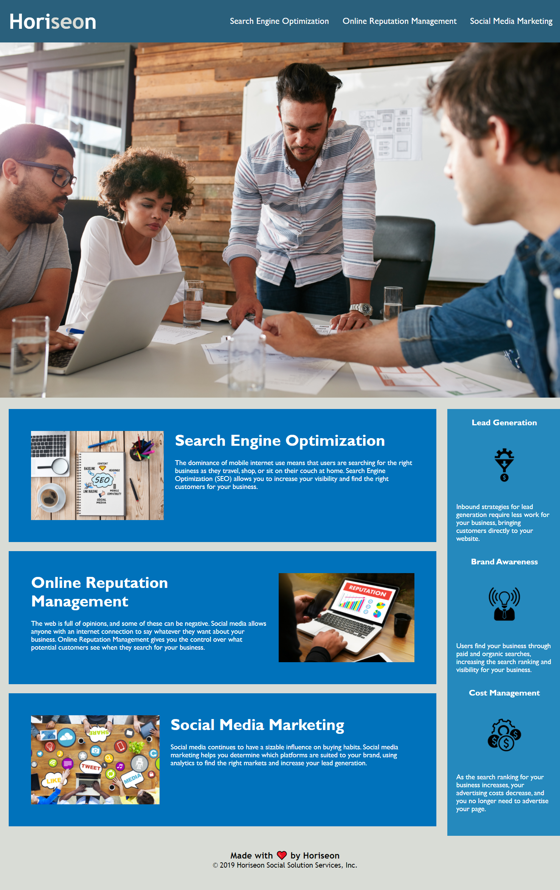

# Weekly Challenge: 01 HTML, CSS, and Git: Code Refactor

# Author
Disha Barua

# Link
Deployed code: https://disha2022.github.io/challenge1_db/

Github repository:https://github.com/Disha2022/challenge1_db

# User Story
```
AS A marketing agency I WANT a codebase that follows accessibility standards SO THAT our site is optimized for search engines
```
# Project Description
Purpose of this project is to refactor an existing webpage to make it accessible and to improve SEO. 

## Tools
1. CSS
2. HTML

## Modification
## index.html
1. Fixed link for "Search engine optimization"
2. Replaced div with header
3. Replaced div with nav
4. removed class "seo" for span and edited style code to formatt span to manage external output like before 
5. Replaced div with section (hero class)
6. Replaced div with main for after "hero" section
7. Added alt tags for all the images.
8. Added footer.
9. Removed some classes from index to add appropriate symantic and make the code easy and simple. Such as : header, seo, online-reputation-management etc.
10. Used 1 class for different section to reduce style code. such as benefit.
11. Added footer
12. Edited css code per change made in index. 

## style.css
1. Removed classes to avoid redundency and minimize the code.
2. Updated Css per modification made in index file

## webpage photo after modification



# References

## Acceptance Criteria
```
GIVEN a webpage that meets accessibility standards
WHEN I view the source code
THEN I find semantic HTML elements

WHEN I view the structure of the HTML elements
THEN I find that the elements follow a logical structure independent of styling and positioning

WHEN I view the icon and image elements
THEN I find accessible alt attributes

WHEN I view the heading attributes
THEN I find that they fall in sequential order

WHEN I view the title element
THEN I find a concise, descriptive title
```

## Review

You are required to submit the following for review:

* The URL of the deployed application.

* The URL of the GitHub repository. Give the repository a unique name and include a professional README describing the project.

- - -
© 2022 Trilogy Education Services, LLC, a 2U, Inc. brand. Confidential and Proprietary. All Rights Reserved.
